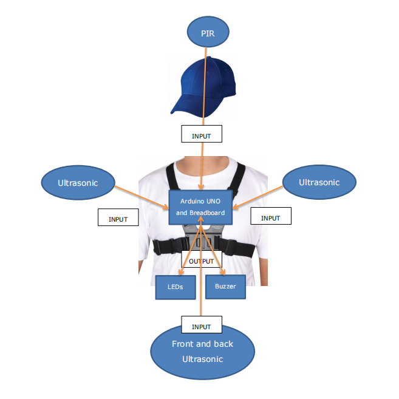
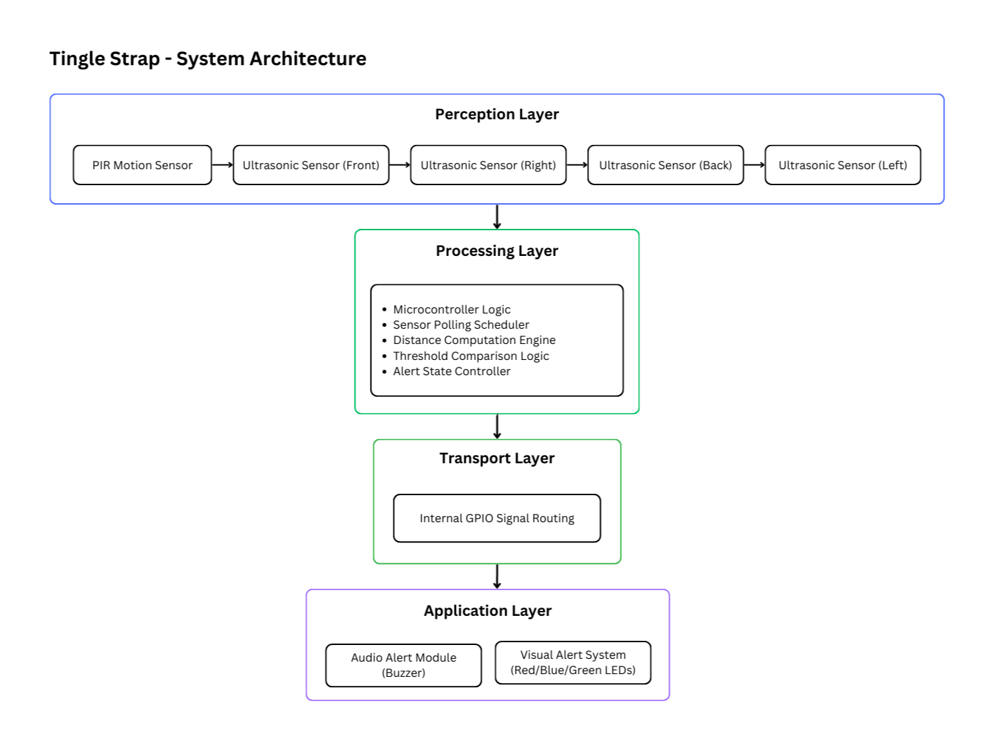

<p align="center">
  
</p>

<h1 align="center">Tingle Strap</h1>
<p align="center">
  <strong>360° Wearable IoT Proximity Intelligence System</strong>
</p>

<p align="center">
  <a href="https://open.spotify.com/track/1DhRbox3xkceP64k3JeYfW"></a>
  
  
  
  
  
  
</p>

<p align="center">
  
</p>

## 📌 Overview

[Tingle Strap](https://htutmyatoo.github.io/tingle-strap/) is a wearable chest-mounted proximity awareness system designed to enhance spatial awareness in dynamic environments.

The concept originated during the COVID-19 pandemic, where maintaining safe physical distance became a global challenge. While inspired by that context, the system is not limited to health-related scenarios. It serves as a foundational wearable IoT prototype for real-time spatial monitoring applications.

The device performs **multi-directional (360°) distance detection** using ultrasonic sensors, integrates motion sensing through PIR detection, and provides immediate visual and audio feedback when predefined proximity thresholds are breached.

This project demonstrates applied embedded systems design, sensor integration, and wearable IoT prototyping.

## 🎯 Key Features

- 360° ultrasonic proximity detection  
- PIR motion awareness integration  
- Real-time alert feedback (LED + Buzzer)  
- Configurable safety threshold (default: 182.88 cm / 6 ft)  
- Wearable chest-mounted prototype  
- Modular firmware structure  
- Designed for scalability and future optimization  

## 🧠 System Architecture

Tingle Strap follows a simplified IoT layered structure:

<p align="left">
  
</p>

## 📏 Detection Logic

- Default safety threshold: **182.88 cm (6 feet)**
- Each ultrasonic sensor monitors a fixed direction
- If **any direction** detects an object within threshold:
  - 🔴 Red LED activates  
  - 🔊 Buzzer sounds  
- If all directions remain outside threshold:
  - 🟢 Green LED remains active  

The PIR sensor enhances environmental responsiveness and supports motion-based context awareness.

## ⚙️ Hardware Components

- Arduino Uno  
- 4 × HC-SR04 Ultrasonic Sensors  
- PIR Motion Sensor  
- Piezo Buzzer  
- Red LED
- Blue LED 
- Green LED  
- Resistors  
- Breadboard / Custom Mount  
- 5V Power Bank  
- Wearable Chest Strap Assembly  

## 🔌 Wiring & Circuit Design

[](https://htutmyatoo.github.io/tingle-strap/#simulation)

> [!IMPORTANT]
> All components operate at **5V**. Ensure all grounds are connected to a common GND rail.

### 📍 Pin Mapping Overview

| Arduino Pin | Connected Component | Signal Type |
|-------------|--------------------|-------------|
| D2  | Blue LED | Output |
| D3  | Red LED | Output |
| D4  | Front Ultrasonic – Echo | Input |
| D5  | Front Ultrasonic – Trigger | Output |
| D6  | Back Ultrasonic – Echo | Input |
| D7  | Back Ultrasonic – Trigger | Output |
| D8  | Left Ultrasonic – Echo | Input |
| D9  | Left Ultrasonic – Trigger | Output |
| D10 | Right Ultrasonic – Echo | Input |
| D11 | Right Ultrasonic – Trigger | Output |
| D12 | PIR Sensor – OUT | Input |
| D13 | Buzzer | Output |
| A1  | Green LED | Output |

> For detailed wearable assembly guidance, cable management layout, and optimized hardware build documentation, see the extended build package.

## 🧪 Testing & Validation

The prototype has been tested in:

- Indoor corridor simulations  
- Controlled proximity breach scenarios  
- Multi-directional movement environments  

Testing confirms consistent detection performance within the defined safety threshold under stable conditions.

## 🎥 Demonstration
[](https://htutmyatoo.github.io/tingle-strap/#demo)

- ▶️[Real-World Testing Footage](https://htutmyatoo.github.io/tingle-strap/#demo)
- 🧑‍💻[Code Walkthrough Explanation](https://htutmyatoo.github.io/tingle-strap/#demo)
- 🧰[Wokwi Simulation](https://htutmyatoo.github.io/tingle-strap/#simulation)
  
## 🚀 Installation & Setup

### Requirements

- Arduino IDE  
- USB cable  
- Assembled hardware according to circuit diagram  

### Steps

```bash
git clone https://github.com/htutmyatoo/tingle-strap.git
```

1. Wire the hardware according to curcuit diagram 
2. Open ```tingle_strap_basic.ino``` in Arduino IDE
3. Connect Arduino Uno and Upload firmware
4. Power via 5V power bank or battery
5. Mount onto wearable strap and test (Optional)

## 📂 Repository Structure
```
tingle-strap/
├── .gitignore
├── LICENSE
├── README.md
├── Tingle_Strap.ino
├── assets/
│   ├── hardware-architecture.png
│   ├── simulation_demo.gif
│   └── system-architecture-diagram.png
└── index.html
```

## 🔮 Future Improvements

This prototype serves as a foundation for further wearable IoT development. Planned enhancements include:

- Non-blocking firmware architecture (millis-based timing)
- Power optimization for extended wearable use
- Vibration motor haptic feedback
- Bluetooth or BLE data logging
- Mobile companion dashboard
- Adaptive threshold based on environment
- Compact PCB-based hardware design
- 3D printed ergonomic enclosure
- Sensor fusion refinement for interference reduction

## 📜 License

Released under the Apache License 2.0.

This repository contains the Community Edition firmware for educational, experimental, and non-commercial use.
See the LICENSE file for details.

## 🍥 Support
<a href="https://ko-fi.com/J3J21UINNT" target="_blank">
  
</a>
